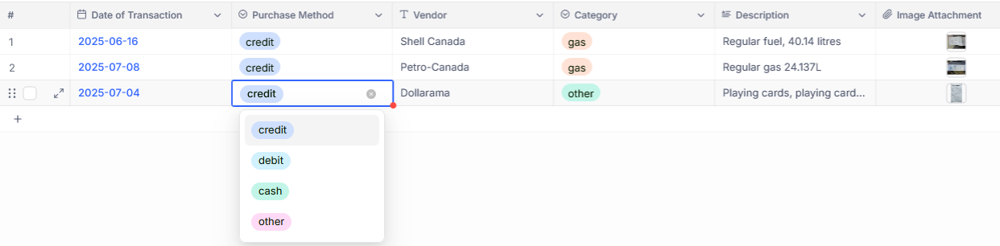

# receipts-to-postgres

This Python script automates the process of extracting transaction data from receipt images using a Large Language Model (LLM) and then uploading the structured data to either a Supabase PostgreSQL database or a NocoDB instance. It's designed to help you digitize and organize your physical receipts efficiently.

## Features

*   **Intelligent Data Extraction**: Utilizes an LLM (configured for local or remote APIs) to extract key information such as `date_of_transaction`, `vendor`, `category`, and `brief_description_of_purchased_items` from receipt images.
*   **Flexible Image Support**: Processes common image formats including PNG, JPG, JPEG, GIF, BMP, and TIFF.
*   **Supabase Integration**: Seamlessly uploads extracted transaction data to a specified Supabase PostgreSQL table.
*   **NocoDB Integration**: Supports uploading extracted data to NocoDB, including the original receipt image as an attachment.
*   **Configurable**: All API keys, database credentials, and feature toggles are managed via environment variables for easy setup and secure handling.
*   **Category Validation**: Ensures extracted categories conform to a predefined list, defaulting to 'other' if an invalid category is identified.

## Setup and Installation

### Prerequisites

*   Python 3.x installed on your system.

### Environment Variables

Create a `.env` file in the root directory of the project and populate it with the following variables. Replace the placeholder values with your actual credentials and settings.

```dotenv
# Feature Toggles
SUPABASE_ENABLED="True"  # Set to "False" to disable Supabase uploads
NOCODB_ENABLED="True"    # Set to "False" to disable NocoDB uploads

# Supabase PostgreSQL Connection Details
SUPABASE_HOST="your_supabase_host"
SUPABASE_PORT="6543" # Use the pooler port
SUPABASE_DATABASE="postgres"
SUPABASE_USER="your_supabase_user" # IMPORTANT: Use the full user string
SUPABASE_PASSWORD="your_supabase_password"

# NocoDB API Details
NOCODB_API_BASE_URL="https://app.nocodb.com" # Or your self-hosted NocoDB URL
NOCODB_TABLE_ID="your_nocodb_table_id" # IMPORTANT: Replace with your actual NocoDB Table ID
NOCODB_API_TOKEN="your_nocodb_api_token" # IMPORTANT: Replace with your actual NocoDB API Token

# OpenAI API Details (for LLM)
# If using LM Studio or a local LLM, set OPENAI_BASE_URL and OPENAI_API_KEY accordingly.
# For LM Studio, OPENAI_API_KEY can often be "lm-studio".
OPENAI_BASE_URL="http://localhost:1234/v1" # Example for LM Studio
OPENAI_API_KEY="lm-studio" # Example for LM Studio, or your actual OpenAI API Key
```

### Dependencies

Install the required Python packages using pip:

```bash
pip install requirements.txt
```

### NocoDB Setup

To integrate with NocoDB, you'll need to set up a table with appropriate columns. The script expects columns like "Date of Transaction", "Purchase Method", "Vendor", "Category", "Description", and "Image Attachment".

Here's an example of how your NocoDB table might look:



Ensure your NocoDB API Token and Table ID are correctly configured in the `.env` file.

## Usage

To run the script, provide the path to the folder containing your receipt images as a command-line argument:

```bash
python main.py /path/to/your/receipts/folder
```

The script will iterate through all supported image files in the specified folder, process them with the LLM, and then attempt to upload the extracted data to Supabase and/or NocoDB based on your `.env` configuration.

## LLM Configuration

The script uses the `openai` library, which is configured to work with a custom base URL and API key. This allows for easy integration with local LLM solutions like [LM Studio](https://lmstudio.ai/) or other compatible OpenAI-API-compatible servers.

The `LLM_INSTRUCTION_PROMPT` within `main.py` defines the specific instructions given to the LLM for data extraction. You can modify this prompt to fine-tune the extraction process.

## Category Validation

The script includes a predefined set of `VALID_CATEGORIES`. If the LLM extracts a category that is not in this set, it will be automatically set to 'other' to maintain data consistency.

